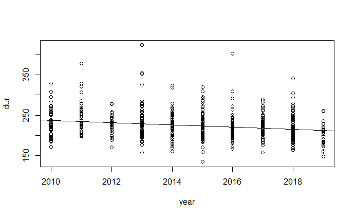

```{r setup, include = FALSE}

knitr::opts_chunk$set(echo = FALSE)

# Cargar los paquetes necesarios
library(tidyr)
library(dplyr)

# Cargar los datos
data <- read.csv("data/top10s.csv")

```

# Informe hits de Spotify 2010-2019

## Datos

Top Spotify Songs 2010-2019

<https://www.kaggle.com/datasets/leonardopena/top-spotify-songs-from-20102019-by-year/>

## Artistas con más hits

```{r top_artists}

data %>% dplyr::count(artist) %>% arrange(desc(n)) %>% head()

```

## Estilos con más exitos

```{r top_genres}

data %>% dplyr::count(top.genre) %>% arrange(desc(n)) %>% head()

```

## Tendencia de la duración de los hits

```{r duration_trend}

plot(dur ~ year, data = data)
abline(lm(dur ~ year, data = data))

```



La tendencia de duración de los hits entre los años 2010-2019 es decreciente.
